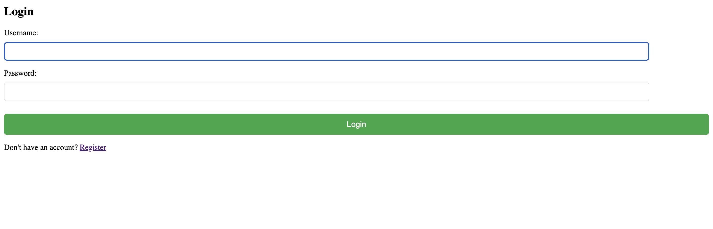
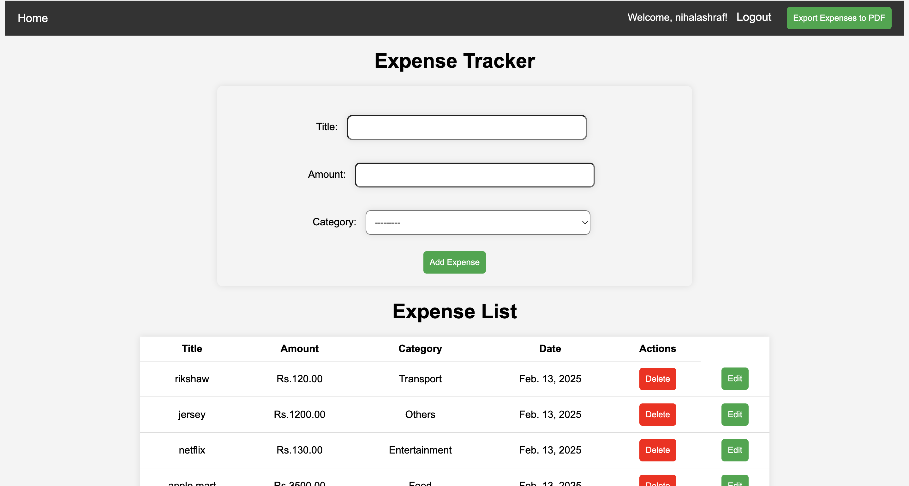
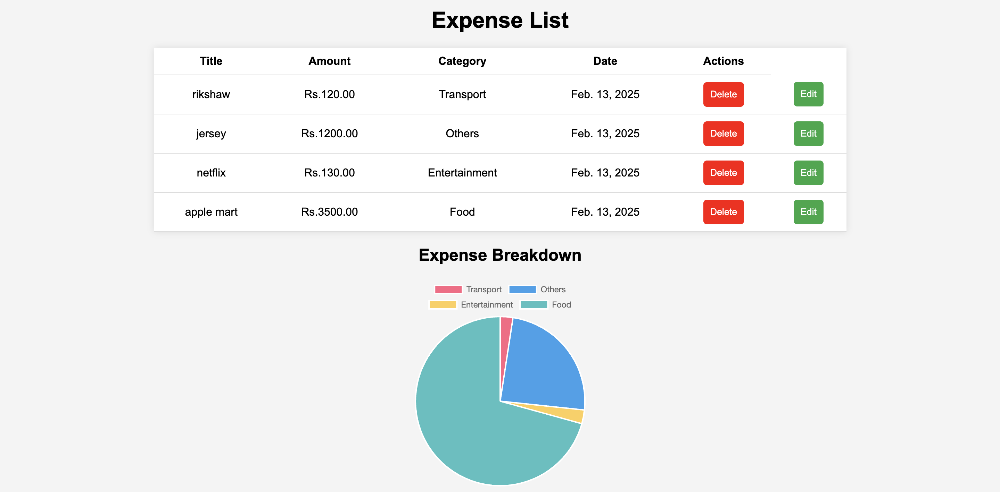
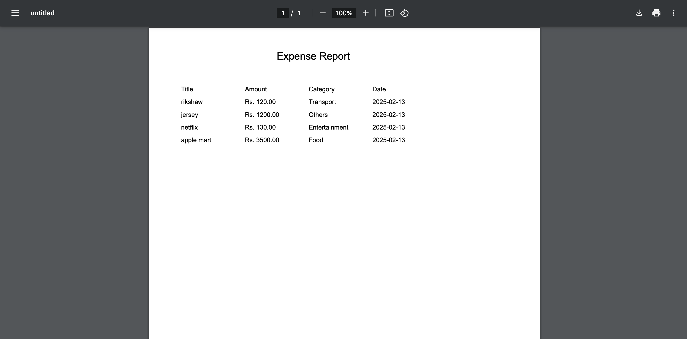
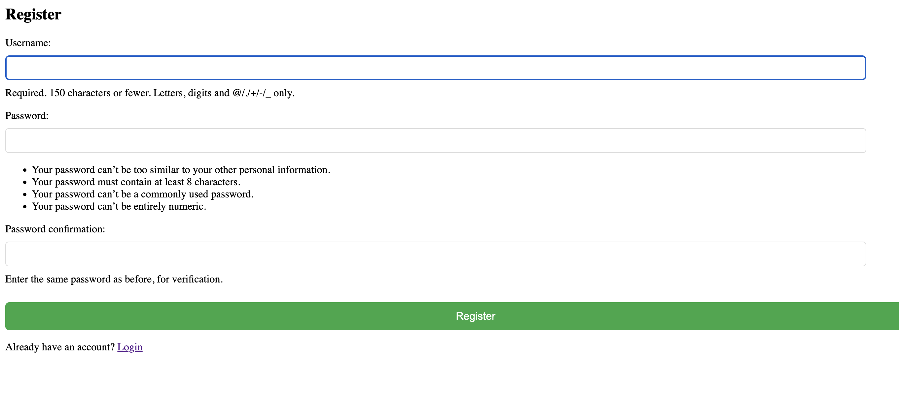

# Expense Tracker

A simple expense tracker built with Django, HTML, CSS, and JavaScript.

## Screenshots

### **Login Page**


### **Expense Dashboard**


### **Expense Chart**


### **Pdf Generated**


### **signup page**



## Features
✅ User authentication (Login/Register)  
✅ Add, edit, and delete expenses  
✅ Visualize expenses with charts  
✅ Export data to CSV/PDF  
 

## Installation
1. Clone the repo:  
   ```bash
   git clone https://github.com/your-username/expense-tracker.git
   cd expense-tracker
